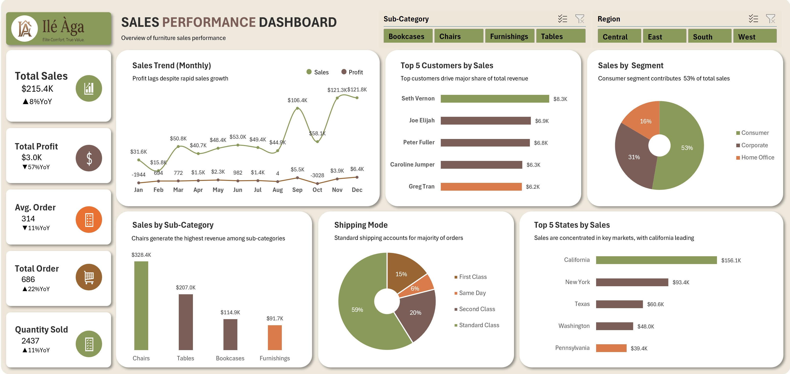

# 📊 Furniture Sales Performance Analysis


> A comprehensive furniture sales performance analytics project using **Microsoft Excel** to analyze sales performance, customer behaviour, regional trends, and product performance for a fictional furniture company.



---

## 📖 Project Overview

This project analyzed **2,121 retail transactions** from a fictional furniture company.

The objective was to uncover sales trends, evaluate regional and product performance, understand customer purchasing behaviour, and provide actionable recommendations through data analysis and interactive dashboards.

The project employed and demonstrates the analytics steps of data cleaning, columns standardization, pivot tables creations & analysis, and dashboard development.

---

## 🎯 Business Problem

Although the Company has experienced consistent revenue growth, management identified that some regions and product categories continue to underperform and wants to know how sales were performig by product, customer, location, payment method and time.

As a Data Analyst, I was tasked with identifying performance gaps between sales by Cities, branches, customer types and product lines, I also had to uncover sales patterns over time, establish customers' payment methods, and recommend strategies to improve profitability and operational efficiency.

---

## ❓ Business Questions

This analysis answers the following questions:

1. What is the total sales generated by the furniture company?
2. What is the total profit earned by the company?
3. Which product sub-category generates the highest sales?
4. Which state contributes the most sales?
5. Which shipping mode generates the highest sales?
6. Which sales segment generate the highest sales?
7. How have sales and profit changed over time?
8. Which top 5 customers account for the highest share of total revenue?


---

## 📂 Dataset

| Attribute | Description |
|-----------|-------------|
| Dataset | furniture-sales-dataset.xlsx |
| Records | 2,121 |
| Period | 2014 - 2018 |
| Industry | Retail / E-Commerce |
| Company |  Fictional |

---

## 🛠️ Tools & Technologies

| Tool | Purpose |
|------|---------|
| Microsoft Excel | Pivot Tables & Dashboard |
| Git & GitHub | Version Control & Documentation |

---

## 🔄 Project Workflow

- Data Collection
- Data Cleaning and columns standardization
- Excel Analysis and Pivot Charts
- Excel Dashboard Development
- Business Insights
- Recommendations

---

## 📊 Dashboard Preview

### Excel Dashboard


---

## 📈 Key Performance Indicators (KPIs)

- **Total Sales:** $215.4K
- **Total Profit:** $3.0K
- **Total Order:** 686
- **Total Quantity Sold:** 2,437
- **Average Order:** 314
- 
---

## 💡 Key Insights

This analysis uncovered the following insights:

1. The business recorded $215.4K in revenue from 686 orders with an average order of 314 with 8% YoY increase.
2. Sales are concentrated in key markets, with California leading.
3. Profit lags despite rapid sales growth with 57%YoY decrease.
4. Consumer segment contributes  53% of total sales.
5. Chairs generate the highest revenue among sub-categories.
6. Standard shipping accounts for majority of orders at 59%.
7. Total Orders increased by 22%YoY, yet there's decline in profit
8. Average Order decrease by 11%YoY, yet Quantity of products sold increased by same value YoY.


---

## 🚀 Recommendations

Below are the recommendations made from the analysis:

1. To be updated
2. To be updated
3. To be updated
4. To be updated
5. To be updated
6. To be updated
7. To be updated


---

## 📁 Repository Structure

```text
supermarket-sales-performance-analysis/
│
├── data/
│   ├── raw/
│   └── cleaned/
├── excel-dashboard/
├── visuals/
├── reports/
└── README.md
```

---

## 👤 Author

**Blessing Usieme**

**Data Analyst - Business Intelligence | Data Visualization and Storytelling**

GitHub: https://github.com/usiemeblessing

LinkedIn: https://linkedin.com/in/blessing-usieme-b31b32396
